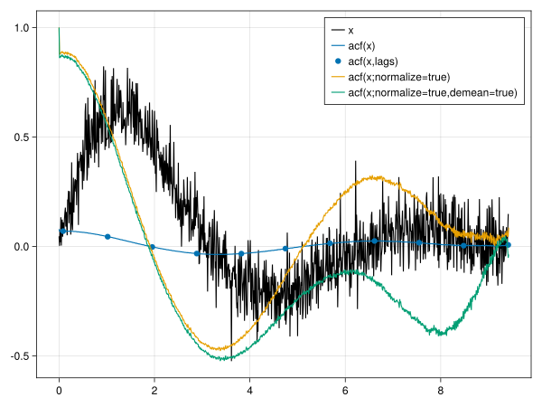

# Autocorrelations.jl

[](https://github.com/mastrof/Autocorrelations.jl/actions/workflows/CI.yml?query=branch%3Amain)

Fast evaluation of autocorrelation functions
```math
f(\tau) = \mathbb{E}\left[X(t)X(t+\tau)\right]
```
for scalar processes $X$ or
```math
f(\tau) = \mathbb{E}\left[\mathbf{X}(t)\cdot\mathbf{X}(t+\tau)\right]
```
for vector processes $\mathbf{X}$.


Specifically, the `acf` function evaluates autocorrelation estimates
of the form
```math
\hat{f}_\tau = \dfrac{1}{T-\tau} \sum_{t=1}^{T-\tau} X_t X_{t+\tau},
\qquad \tau \in [0, T-1]
```
with optional arguments to subtract the mean of the process or to
normalize the resulting autocorrelation function.

`acf(x; demean=true)`:
```math
\hat{f}_\tau = \dfrac{1}{T-\tau} \sum_{t=1}^{T-\tau} (X_t-\bar{X}) (X_{t+\tau}-\bar{X}),
\qquad \tau \in [0, T-1]
```
`acf(x; normalize=true)`:
```math
\hat{f}_\tau = \dfrac{1}{\hat{f}_0(T-\tau)} \sum_{t=1}^{T-\tau} X_t X_{t+\tau},
\qquad \tau \in [0, T-1]
```

```julia
using Autocorrelations
n = 1000
σ = 0.1
τ = 3
t = range(0, 3π; length=n)
x = sin.(t) .* exp.(-t./τ) .+ randn(n).*σ
f1 = acf(x)
lags = round.(Int,range(10, size(x,1)-1; length = 11))
f2 = acf(x, lags)
f3 = acf(x; normalize=true)
f4 = acf(x; normalize=true, demean=true)
```

